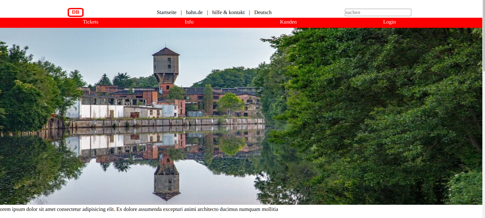
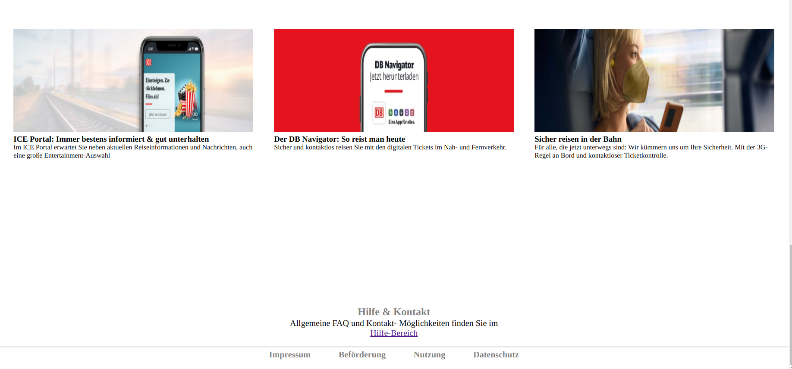

## Db-bahn-clone

**[https://sgujuluva.github.io/db-bahn-clone/](github.io)**

---

#### Navigation

- About Project
  - _This DB bahn website is developed using the HTML5 and CSS_
  - _Mainly the Tools used here are:
  Flex, grid layout, nth child and many more properties_

- Contact
  - _sanghee04@gmail.com_
  - _GitHub Username: sgujuluva_
  
---

### About Project

This Project is about to replicate the website using HTML and CSS. 

##### Developed With

- [x] _HTML5_
- [x] _CSS3_
- [ ] _SASS_
- [ ] _SCSS_
- [ ] _JavaScript_
- [ ] _React_
- [ ] _Bootstrap_
- [ ] _npm_

---

### Contact

Mail: <sanghee04@gmail.com> 
GitHub: [sgujuluva](https://github.com/) 

---

Made with ❤️ by me
